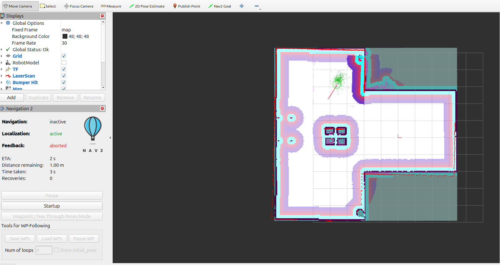

# 🤖 Autonomous Mobile Robot (ROS 2 Jazzy)

A complete autonomous differential drive robot built with **ROS 2 Jazzy**. This project demonstrates Simulation, Simultaneous Localization and Mapping (SLAM), and Autonomous Navigation using the Nav2 stack.

---

## 📸 Screenshots



---

## ✨ Features

* **🕹️ Teleoperation:** Manual control using keyboard teleop.
* **🗺️ SLAM (Simultaneous Localization & Mapping):** Generates 2D occupancy grid maps using `slam_toolbox`.
* **🧠 Autonomous Navigation:** Fully integrated with the **Nav2** stack for path planning and obstacle avoidance.
* **👁️ Perception:** Equipped with Lidar and Camera sensors (simulated in Gazebo).

---

## 🛠️ Prerequisites

* **OS:** Ubuntu 24.04 (Noble Numbat)
* **ROS 2 Distro:** Jazzy Jalisco
* **Simulator:** Gazebo Harmony

### Dependencies
Install the required ROS 2 packages:
```bash
sudo apt install ros-jazzy-navigation2 ros-jazzy-nav2-bringup ros-jazzy-slam-toolbox ros-jazzy-ros-gz
```

---

## 🚀 Installation

1.  **Clone the repository:**
    ```bash
    mkdir -p ~/ros2_ws/src
    cd ~/ros2_ws/src
    git clone https://github.com/akhiljithvg/Autonomous-Navigation-Robot.git
    ```

2.  **Build the workspace:**
    ```bash
    cd ~/ros2_ws
    colcon build --packages-select diff_drive_robot --symlink-install
    source install/setup.bash
    ```

---

## 🏃 Usage Guide

### 1. Launch Simulation
Start the robot in the Gazebo environment:
```bash
ros2 launch diff_drive_robot robot.launch.py use_sim_time:=true
```

### 2. Mapping Mode (SLAM)
To create a new map of the environment:
```bash
ros2 launch diff_drive_robot mapping.launch.py use_sim_time:=true
```

* **Control:** Open a new terminal and run:
    ```bash
    ros2 run teleop_twist_keyboard teleop_twist_keyboard
    ```
* **Save Map:** When finished mapping, run:
    ```bash
    ros2 run nav2_map_server map_saver_cli -f ~/my_map
    ```

### 3. Autonomous Navigation

To run the full system, you need 4 separate terminals open at the same time.

### Terminal 1: Simulation (Gazebo)

```bash
cd ~/ros2_ws
export GZ_SIM_RESOURCE_PATH=~/ros2_ws/src/diff_drive_robot/assets/gazebo_models:$GZ_SIM_RESOURCE_PATH
source install/setup.bash
ros2 launch diff_drive_robot robot.launch.py use_sim_time:=true
```
### Terminal 2: The "Bridge" (Crucial Fix)
This forces the missing link (base_footprint) to exist so Navigation doesn't crash. Keep this running!

```
ros2 run tf2_ros static_transform_publisher 0 0 0 0 0 0 base_link base_footprint --ros-args -p use_sim_time:=true
```

### Terminal 3: Navigation Stack
This runs the "brain" of the robot.
```
source ~/ros2_ws/install/setup.bash
ros2 launch nav2_bringup bringup_launch.py map:=/home/akhiljith/ros2_ws/src/diff_drive_robot/maps/my_first_map.yaml use_sim_time:=true
```
(Note: Replace /home/akhiljith/my_first_map.yaml with the actual path to your map file).

### Terminal 4: RViz (Visualization)
This is your control screen.
```
ros2 run rviz2 rviz2 -d /opt/ros/jazzy/share/nav2_bringup/rviz/nav2_default_view.rviz --ros-args -p use_sim_time:=true

```

#### How to Navigate:
1.  Open **RViz**.
2.  Click **"2D Pose Estimate"** and set the robot's current position on the map.
3.  Click **"Nav2 Goal"** and click anywhere on the map to send the robot there!

---

## 📂 Project Structure

```bash
diff_drive_robot/
├── launch/             # Launch files for Robot, Mapping, and Navigation
├── urdf/               # Robot description (Xacro/URDF)
├── worlds/             # Gazebo world files
├── maps/               # Saved maps (.yaml and .png)
├── rviz/               # RViz configuration files
└── package.xml
```

---

## 👨‍💻 Author

**Akhiljith Gigi**
* GitHub: [@akhiljithvg](https://github.com/akhiljithvg)
